# Discord にゃんこエージェント シーケンス図

## 1. Discord Bot基本機能

### 1.1 新規ユーザー参加時のウェルカムフロー

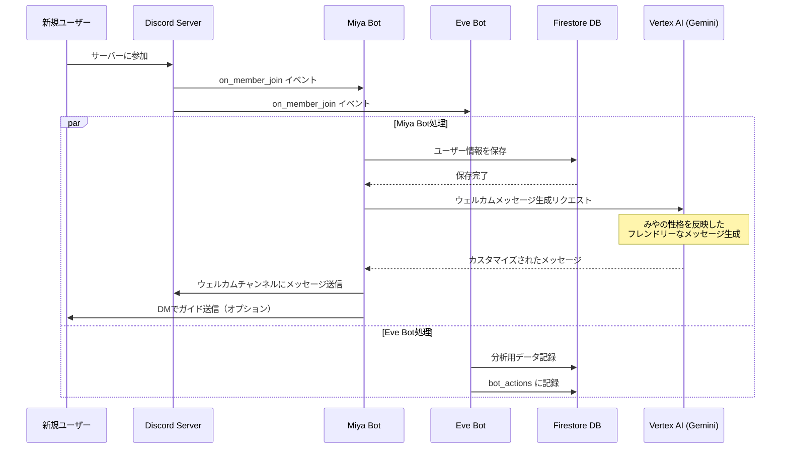
```mermaid
sequenceDiagram
    participant User as 新規ユーザー
    participant Discord as Discord Server
    participant Miya as Miya Bot
    participant Eve as Eve Bot
    participant Firestore as Firestore DB
    participant AI as Vertex AI (Gemini)

    User->>Discord: サーバーに参加
    Discord->>Miya: on_member_join イベント
    Discord->>Eve: on_member_join イベント
    
    par Miya Bot処理
        Miya->>Firestore: ユーザー情報を保存
        Firestore-->>Miya: 保存完了
        Miya->>AI: ウェルカムメッセージ生成リクエスト
        Note over AI: みやの性格を反映した<br/>フレンドリーなメッセージ生成
        AI-->>Miya: カスタマイズされたメッセージ
        Miya->>Discord: ウェルカムチャンネルにメッセージ送信
        Miya->>User: DMでガイド送信（オプション）
    and Eve Bot処理
        Eve->>Firestore: 分析用データ記録
        Eve->>Firestore: bot_actions に記録
    end
```

### 1.2 メンション応答フロー

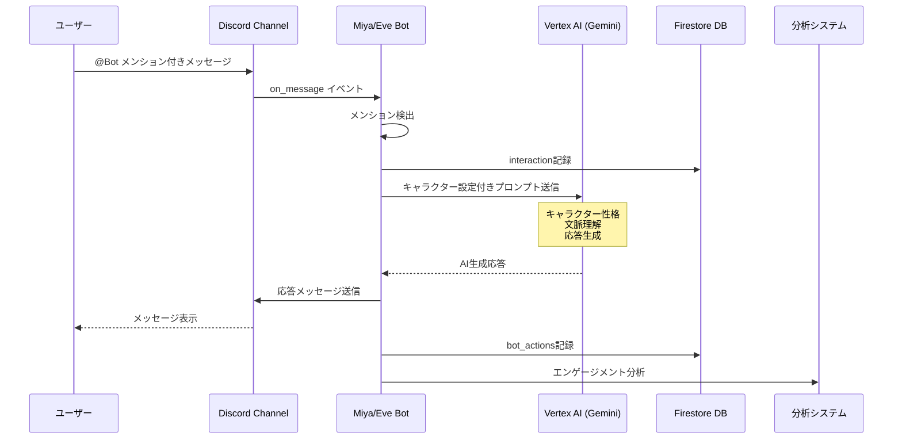
```mermaid
sequenceDiagram
    participant User as ユーザー
    participant Discord as Discord Channel
    participant Bot as Miya/Eve Bot
    participant AI as Vertex AI (Gemini)
    participant Firestore as Firestore DB
    participant Analytics as 分析システム

    User->>Discord: @Bot メンション付きメッセージ
    Discord->>Bot: on_message イベント
    
    Bot->>Bot: メンション検出
    Bot->>Firestore: interaction記録
    
    Bot->>AI: キャラクター設定付きプロンプト送信
    Note over AI: キャラクター性格<br/>文脈理解<br/>応答生成
    AI-->>Bot: AI生成応答
    
    Bot->>Discord: 応答メッセージ送信
    Discord-->>User: メッセージ表示
    
    Bot->>Firestore: bot_actions記録
    Bot->>Analytics: エンゲージメント分析
```

### 1.3 自然会話検出フロー

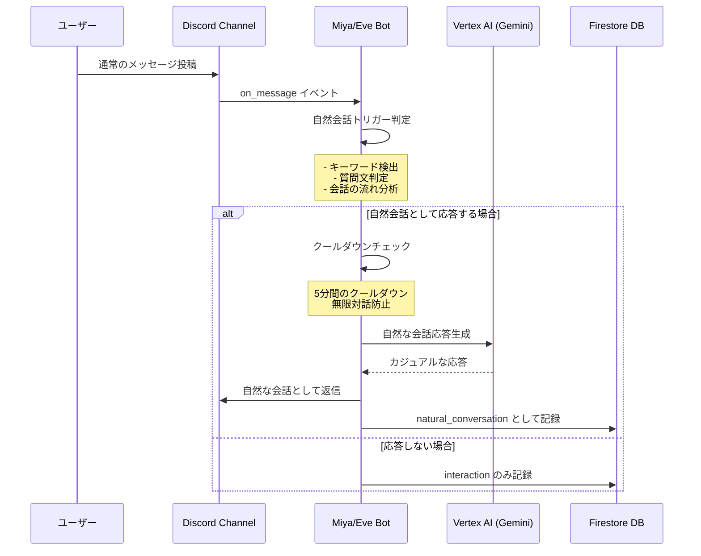
```mermaid
sequenceDiagram
    participant User as ユーザー
    participant Discord as Discord Channel
    participant Bot as Miya/Eve Bot
    participant AI as Vertex AI (Gemini)
    participant Firestore as Firestore DB

    User->>Discord: 通常のメッセージ投稿
    Discord->>Bot: on_message イベント
    
    Bot->>Bot: 自然会話トリガー判定
    Note over Bot: - キーワード検出<br/>- 質問文判定<br/>- 会話の流れ分析
    
    alt 自然会話として応答する場合
        Bot->>Bot: クールダウンチェック
        Note over Bot: 5分間のクールダウン<br/>無限対話防止
        
        Bot->>AI: 自然な会話応答生成
        AI-->>Bot: カジュアルな応答
        
        Bot->>Discord: 自然な会話として返信
        Bot->>Firestore: natural_conversation として記録
    else 応答しない場合
        Bot->>Firestore: interaction のみ記録
    end
```

## 2. Firebase Functions分析機能

### 2.1 Discord ログ分析 (analyzeDiscordLogs)

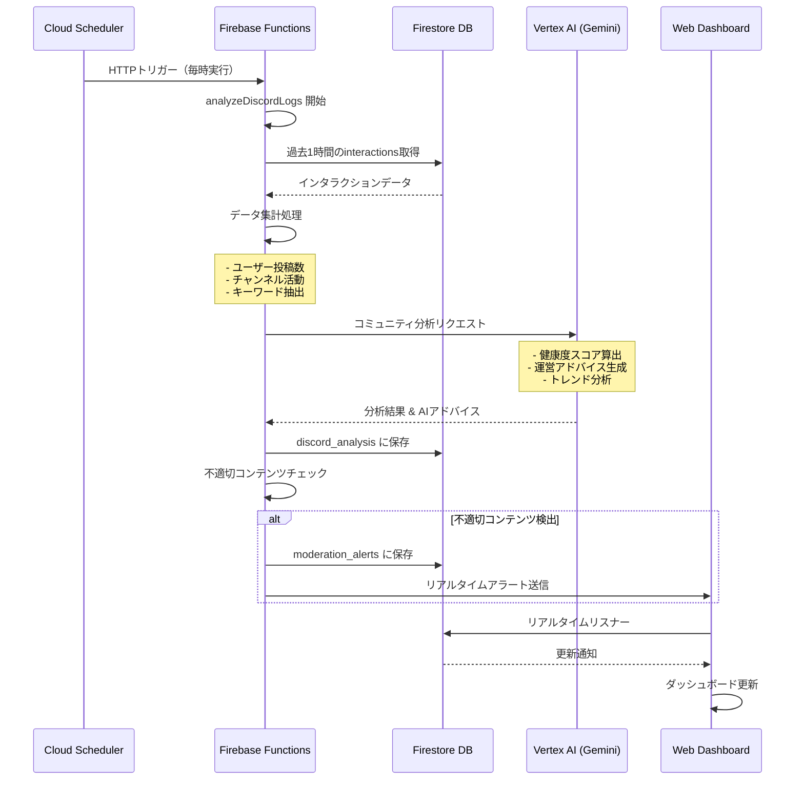
```mermaid
sequenceDiagram
    participant Scheduler as Cloud Scheduler
    participant Functions as Firebase Functions
    participant Firestore as Firestore DB
    participant AI as Vertex AI (Gemini)
    participant Web as Web Dashboard

    Scheduler->>Functions: HTTPトリガー（毎時実行）
    Functions->>Functions: analyzeDiscordLogs 開始
    
    Functions->>Firestore: 過去1時間のinteractions取得
    Firestore-->>Functions: インタラクションデータ
    
    Functions->>Functions: データ集計処理
    Note over Functions: - ユーザー投稿数<br/>- チャンネル活動<br/>- キーワード抽出
    
    Functions->>AI: コミュニティ分析リクエスト
    Note over AI: - 健康度スコア算出<br/>- 運営アドバイス生成<br/>- トレンド分析
    AI-->>Functions: 分析結果 & AIアドバイス
    
    Functions->>Firestore: discord_analysis に保存
    
    Functions->>Functions: 不適切コンテンツチェック
    alt 不適切コンテンツ検出
        Functions->>Firestore: moderation_alerts に保存
        Functions->>Web: リアルタイムアラート送信
    end
    
    Web->>Firestore: リアルタイムリスナー
    Firestore-->>Web: 更新通知
    Web->>Web: ダッシュボード更新
```

### 2.2 リアルタイム不適切表現検知 (onInteractionAdded)

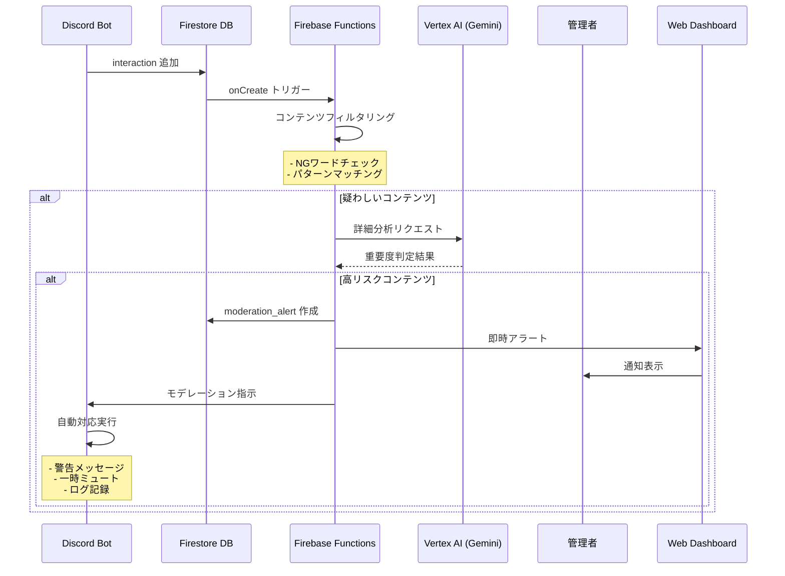
```mermaid
sequenceDiagram
    participant Bot as Discord Bot
    participant Firestore as Firestore DB
    participant Functions as Firebase Functions
    participant AI as Vertex AI (Gemini)
    participant Admin as 管理者
    participant Web as Web Dashboard

    Bot->>Firestore: interaction 追加
    Firestore->>Functions: onCreate トリガー
    
    Functions->>Functions: コンテンツフィルタリング
    Note over Functions: - NGワードチェック<br/>- パターンマッチング
    
    alt 疑わしいコンテンツ
        Functions->>AI: 詳細分析リクエスト
        AI-->>Functions: 重要度判定結果
        
        alt 高リスクコンテンツ
            Functions->>Firestore: moderation_alert 作成
            Functions->>Web: 即時アラート
            Web->>Admin: 通知表示
            
            Functions->>Bot: モデレーション指示
            Bot->>Bot: 自動対応実行
            Note over Bot: - 警告メッセージ<br/>- 一時ミュート<br/>- ログ記録
        end
    end
```

## 3. 週次ポッドキャスト生成

### 3.1 ポッドキャスト生成フロー

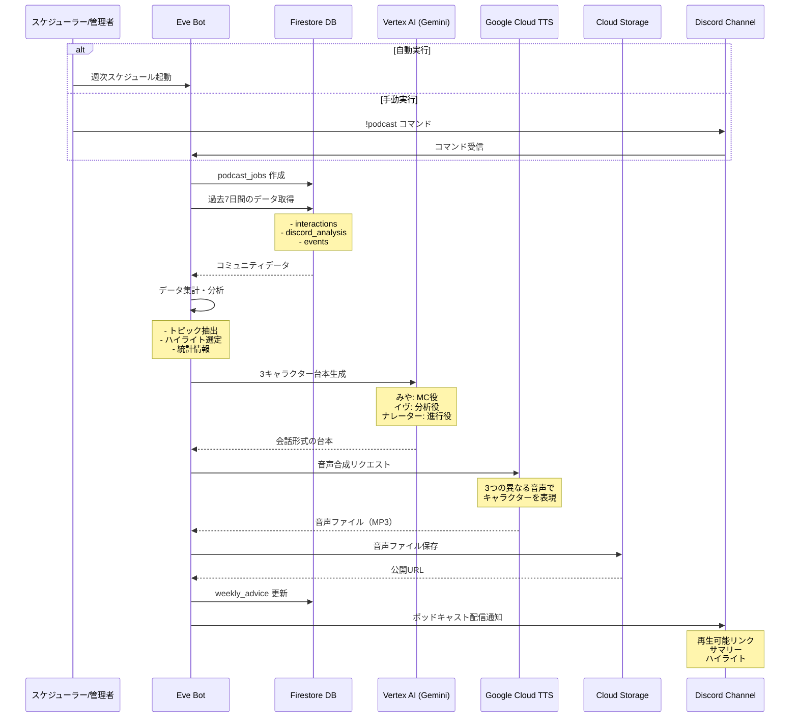
```mermaid
sequenceDiagram
    participant Scheduler as スケジューラー/管理者
    participant Bot as Eve Bot
    participant Firestore as Firestore DB
    participant AI as Vertex AI (Gemini)
    participant TTS as Google Cloud TTS
    participant Storage as Cloud Storage
    participant Discord as Discord Channel

    alt 自動実行
        Scheduler->>Bot: 週次スケジュール起動
    else 手動実行
        Scheduler->>Discord: !podcast コマンド
        Discord->>Bot: コマンド受信
    end
    
    Bot->>Firestore: podcast_jobs 作成
    Bot->>Firestore: 過去7日間のデータ取得
    Note over Firestore: - interactions<br/>- discord_analysis<br/>- events
    Firestore-->>Bot: コミュニティデータ
    
    Bot->>Bot: データ集計・分析
    Note over Bot: - トピック抽出<br/>- ハイライト選定<br/>- 統計情報
    
    Bot->>AI: 3キャラクター台本生成
    Note over AI: みや: MC役<br/>イヴ: 分析役<br/>ナレーター: 進行役
    AI-->>Bot: 会話形式の台本
    
    Bot->>TTS: 音声合成リクエスト
    Note over TTS: 3つの異なる音声で<br/>キャラクターを表現
    TTS-->>Bot: 音声ファイル（MP3）
    
    Bot->>Storage: 音声ファイル保存
    Storage-->>Bot: 公開URL
    
    Bot->>Firestore: weekly_advice 更新
    Bot->>Discord: ポッドキャスト配信通知
    Note over Discord: 再生可能リンク<br/>サマリー<br/>ハイライト
```

### 3.2 ポッドキャストコンテンツ構成

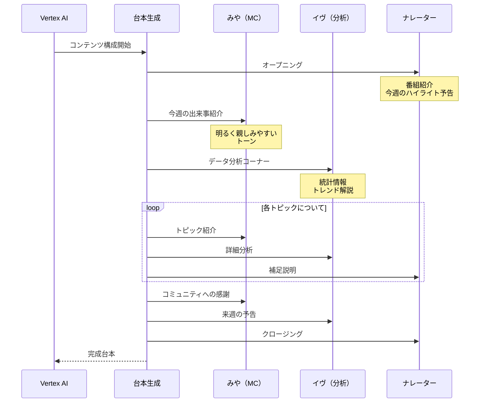
```mermaid
sequenceDiagram
    participant AI as Vertex AI
    participant Script as 台本生成
    participant Miya as みや（MC）
    participant Eve as イヴ（分析）
    participant Narrator as ナレーター

    AI->>Script: コンテンツ構成開始
    
    Script->>Narrator: オープニング
    Note over Narrator: 番組紹介<br/>今週のハイライト予告
    
    Script->>Miya: 今週の出来事紹介
    Note over Miya: 明るく親しみやすい<br/>トーン
    
    Script->>Eve: データ分析コーナー
    Note over Eve: 統計情報<br/>トレンド解説
    
    loop 各トピックについて
        Script->>Miya: トピック紹介
        Script->>Eve: 詳細分析
        Script->>Narrator: 補足説明
    end
    
    Script->>Miya: コミュニティへの感謝
    Script->>Eve: 来週の予告
    Script->>Narrator: クロージング
    
    Script-->>AI: 完成台本
```

## 4. リアルタイム分析・モデレーション

### 4.1 コミュニティ健康度リアルタイム更新

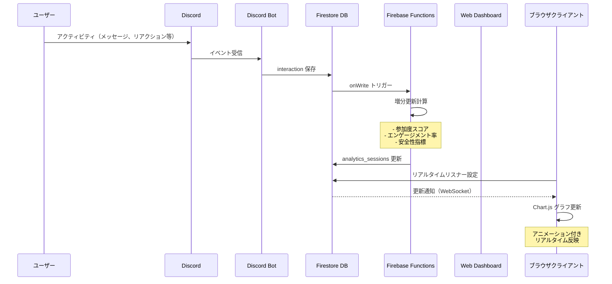
```mermaid
sequenceDiagram
    participant User as ユーザー
    participant Discord as Discord
    participant Bot as Discord Bot
    participant Firestore as Firestore DB
    participant Functions as Firebase Functions
    participant Web as Web Dashboard
    participant Client as ブラウザクライアント

    User->>Discord: アクティビティ（メッセージ、リアクション等）
    Discord->>Bot: イベント受信
    Bot->>Firestore: interaction 保存
    
    Firestore->>Functions: onWrite トリガー
    Functions->>Functions: 増分更新計算
    Note over Functions: - 参加度スコア<br/>- エンゲージメント率<br/>- 安全性指標
    
    Functions->>Firestore: analytics_sessions 更新
    
    Client->>Firestore: リアルタイムリスナー設定
    Firestore-->>Client: 更新通知（WebSocket）
    
    Client->>Client: Chart.js グラフ更新
    Note over Client: アニメーション付き<br/>リアルタイム反映
```

### 4.2 AIアドバイス自動生成フロー

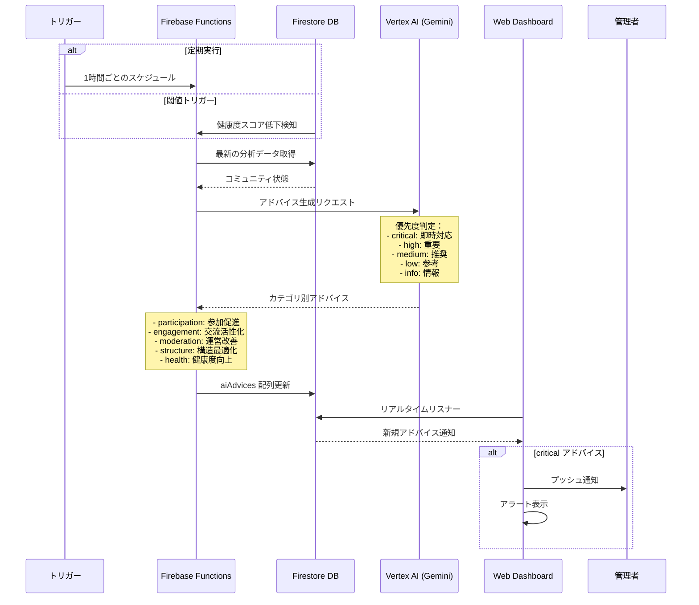
```mermaid
sequenceDiagram
    participant Trigger as トリガー
    participant Functions as Firebase Functions
    participant Firestore as Firestore DB
    participant AI as Vertex AI (Gemini)
    participant Web as Web Dashboard
    participant Admin as 管理者

    alt 定期実行
        Trigger->>Functions: 1時間ごとのスケジュール
    else 閾値トリガー
        Firestore->>Functions: 健康度スコア低下検知
    end
    
    Functions->>Firestore: 最新の分析データ取得
    Firestore-->>Functions: コミュニティ状態
    
    Functions->>AI: アドバイス生成リクエスト
    Note over AI: 優先度判定：<br/>- critical: 即時対応<br/>- high: 重要<br/>- medium: 推奨<br/>- low: 参考<br/>- info: 情報
    
    AI-->>Functions: カテゴリ別アドバイス
    Note over Functions: - participation: 参加促進<br/>- engagement: 交流活性化<br/>- moderation: 運営改善<br/>- structure: 構造最適化<br/>- health: 健康度向上
    
    Functions->>Firestore: aiAdvices 配列更新
    
    Web->>Firestore: リアルタイムリスナー
    Firestore-->>Web: 新規アドバイス通知
    
    alt critical アドバイス
        Web->>Admin: プッシュ通知
        Web->>Web: アラート表示
    end
```

## 5. Webダッシュボード表示

### 5.1 初期ロードとリアルタイム同期

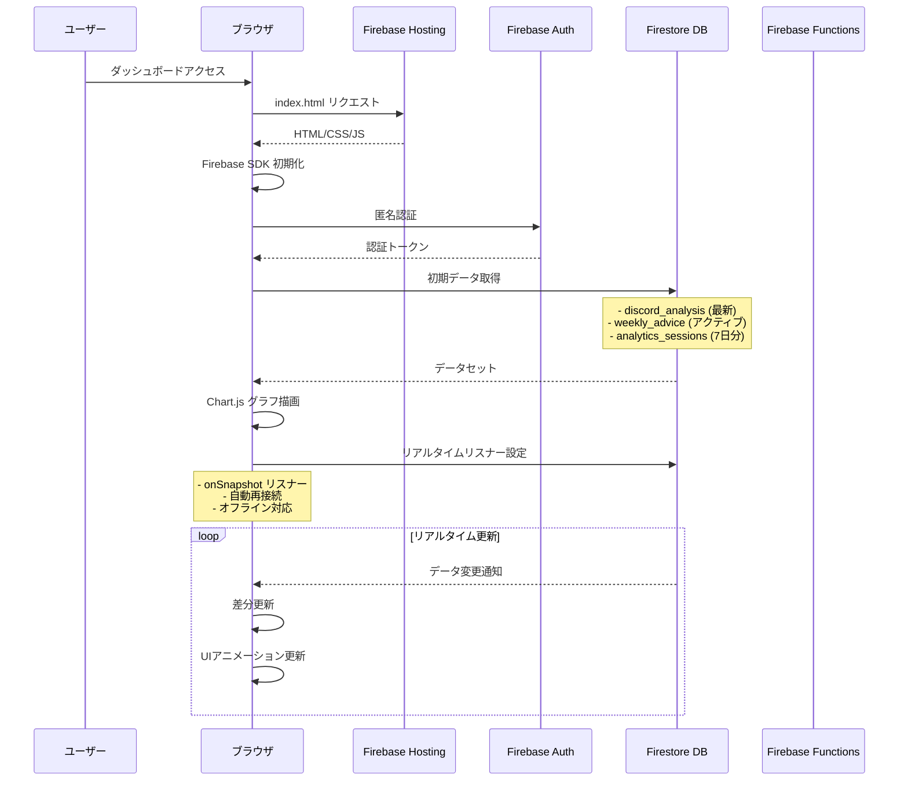
```mermaid
sequenceDiagram
    participant User as ユーザー
    participant Browser as ブラウザ
    participant Firebase as Firebase Hosting
    participant Auth as Firebase Auth
    participant Firestore as Firestore DB
    participant Functions as Firebase Functions

    User->>Browser: ダッシュボードアクセス
    Browser->>Firebase: index.html リクエスト
    Firebase-->>Browser: HTML/CSS/JS
    
    Browser->>Browser: Firebase SDK 初期化
    
    Browser->>Auth: 匿名認証
    Auth-->>Browser: 認証トークン
    
    Browser->>Firestore: 初期データ取得
    Note over Firestore: - discord_analysis (最新)<br/>- weekly_advice (アクティブ)<br/>- analytics_sessions (7日分)
    Firestore-->>Browser: データセット
    
    Browser->>Browser: Chart.js グラフ描画
    
    Browser->>Firestore: リアルタイムリスナー設定
    Note over Browser: - onSnapshot リスナー<br/>- 自動再接続<br/>- オフライン対応
    
    loop リアルタイム更新
        Firestore-->>Browser: データ変更通知
        Browser->>Browser: 差分更新
        Browser->>Browser: UIアニメーション更新
    end
```

### 5.2 管理者機能フロー

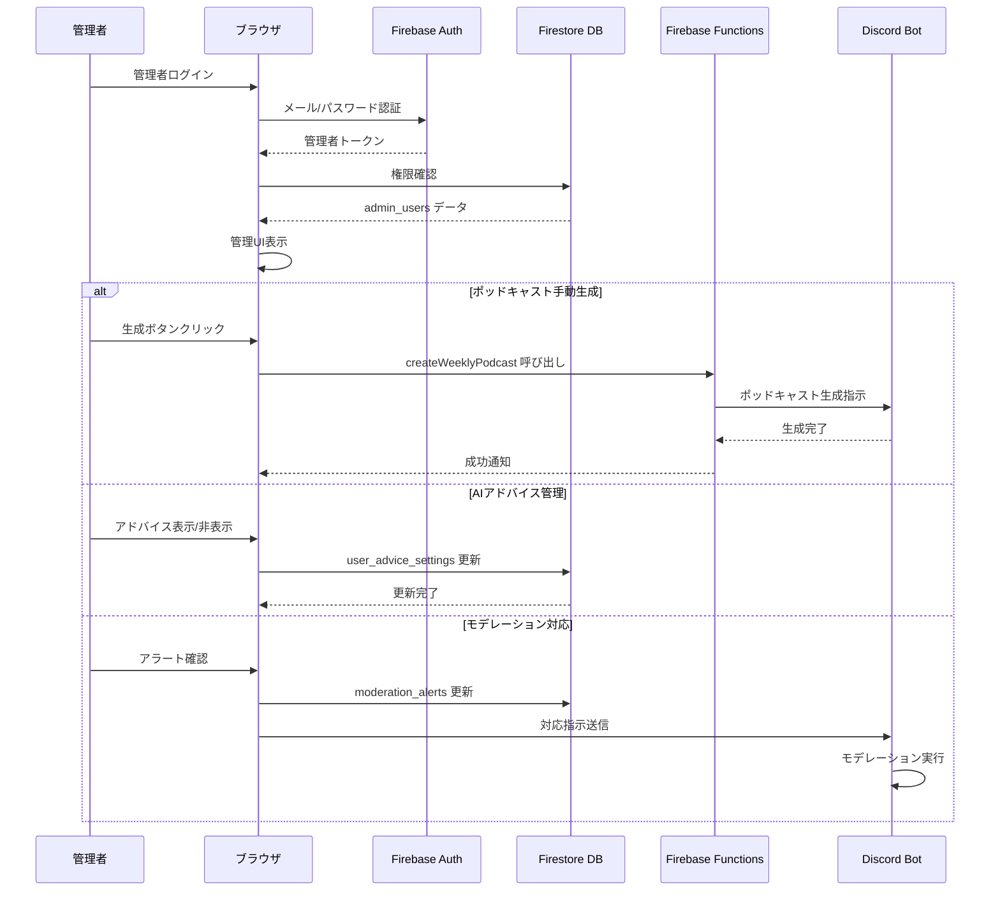
```mermaid
sequenceDiagram
    participant Admin as 管理者
    participant Browser as ブラウザ
    participant Auth as Firebase Auth
    participant Firestore as Firestore DB
    participant Functions as Firebase Functions
    participant Bot as Discord Bot

    Admin->>Browser: 管理者ログイン
    Browser->>Auth: メール/パスワード認証
    Auth-->>Browser: 管理者トークン
    
    Browser->>Firestore: 権限確認
    Firestore-->>Browser: admin_users データ
    
    Browser->>Browser: 管理UI表示
    
    alt ポッドキャスト手動生成
        Admin->>Browser: 生成ボタンクリック
        Browser->>Functions: createWeeklyPodcast 呼び出し
        Functions->>Bot: ポッドキャスト生成指示
        Bot-->>Functions: 生成完了
        Functions-->>Browser: 成功通知
    else AIアドバイス管理
        Admin->>Browser: アドバイス表示/非表示
        Browser->>Firestore: user_advice_settings 更新
        Firestore-->>Browser: 更新完了
    else モデレーション対応
        Admin->>Browser: アラート確認
        Browser->>Firestore: moderation_alerts 更新
        Browser->>Bot: 対応指示送信
        Bot->>Bot: モデレーション実行
    end
```

## 6. ユーザーマッチング機能

### 6.1 マッチング処理フロー

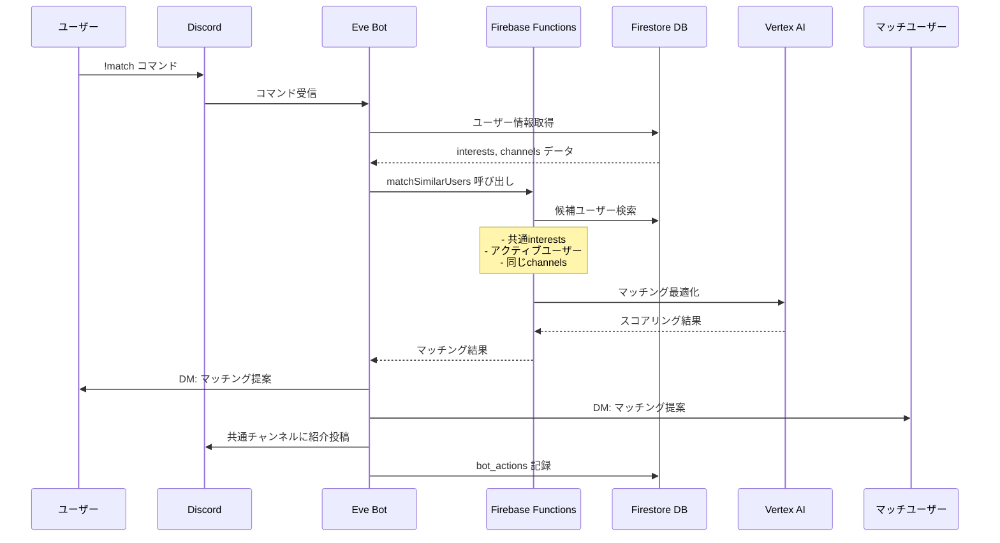
```mermaid
sequenceDiagram
    participant User as ユーザー
    participant Discord as Discord
    participant Eve as Eve Bot
    participant Functions as Firebase Functions
    participant Firestore as Firestore DB
    participant AI as Vertex AI
    participant Matched as マッチユーザー

    User->>Discord: !match コマンド
    Discord->>Eve: コマンド受信
    
    Eve->>Firestore: ユーザー情報取得
    Firestore-->>Eve: interests, channels データ
    
    Eve->>Functions: matchSimilarUsers 呼び出し
    Functions->>Firestore: 候補ユーザー検索
    Note over Functions: - 共通interests<br/>- アクティブユーザー<br/>- 同じchannels
    
    Functions->>AI: マッチング最適化
    AI-->>Functions: スコアリング結果
    
    Functions-->>Eve: マッチング結果
    
    Eve->>User: DM: マッチング提案
    Eve->>Matched: DM: マッチング提案
    
    Eve->>Discord: 共通チャンネルに紹介投稿
    Eve->>Firestore: bot_actions 記録
```

## 7. CI/CDデプロイメントフロー

### 7.1 GitHub Actions 自動デプロイ

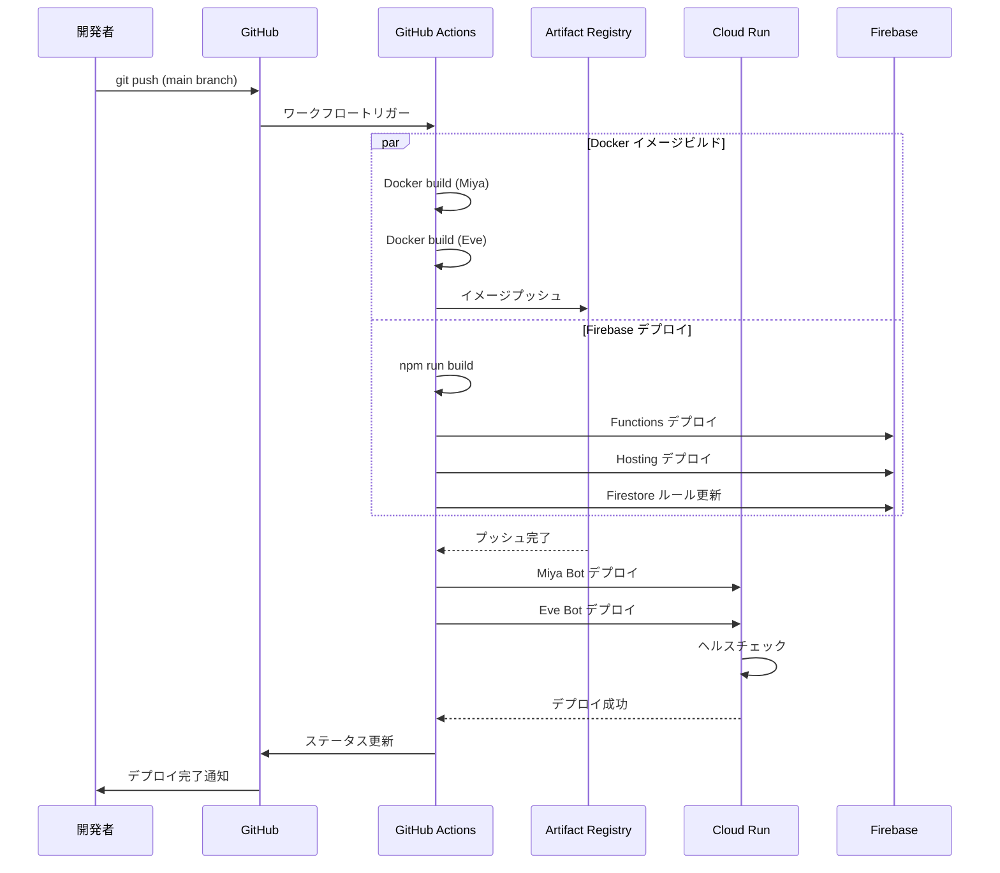
```mermaid
sequenceDiagram
    participant Dev as 開発者
    participant GitHub as GitHub
    participant Actions as GitHub Actions
    participant Registry as Artifact Registry
    participant CloudRun as Cloud Run
    participant Firebase as Firebase

    Dev->>GitHub: git push (main branch)
    GitHub->>Actions: ワークフロートリガー
    
    par Docker イメージビルド
        Actions->>Actions: Docker build (Miya)
        Actions->>Actions: Docker build (Eve)
        Actions->>Registry: イメージプッシュ
    and Firebase デプロイ
        Actions->>Actions: npm run build
        Actions->>Firebase: Functions デプロイ
        Actions->>Firebase: Hosting デプロイ
        Actions->>Firebase: Firestore ルール更新
    end
    
    Registry-->>Actions: プッシュ完了
    
    Actions->>CloudRun: Miya Bot デプロイ
    Actions->>CloudRun: Eve Bot デプロイ
    
    CloudRun->>CloudRun: ヘルスチェック
    CloudRun-->>Actions: デプロイ成功
    
    Actions->>GitHub: ステータス更新
    GitHub->>Dev: デプロイ完了通知
```

### 7.2 Secret Manager 連携

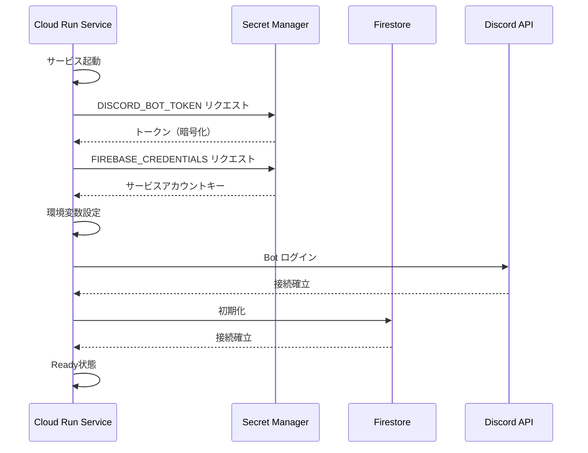
```mermaid
sequenceDiagram
    participant CloudRun as Cloud Run Service
    participant SecretMgr as Secret Manager
    participant Firestore as Firestore
    participant Discord as Discord API

    CloudRun->>CloudRun: サービス起動
    
    CloudRun->>SecretMgr: DISCORD_BOT_TOKEN リクエスト
    SecretMgr-->>CloudRun: トークン（暗号化）
    
    CloudRun->>SecretMgr: FIREBASE_CREDENTIALS リクエスト
    SecretMgr-->>CloudRun: サービスアカウントキー
    
    CloudRun->>CloudRun: 環境変数設定
    
    CloudRun->>Discord: Bot ログイン
    Discord-->>CloudRun: 接続確立
    
    CloudRun->>Firestore: 初期化
    Firestore-->>CloudRun: 接続確立
    
    CloudRun->>CloudRun: Ready状態
```

---

これらのシーケンス図により、Discord にゃんこエージェントの主要な機能フローと、各コンポーネント間の相互作用が明確に可視化されています。各機能は非同期処理とリアルタイム同期を活用し、スケーラブルで応答性の高いシステムを実現しています。