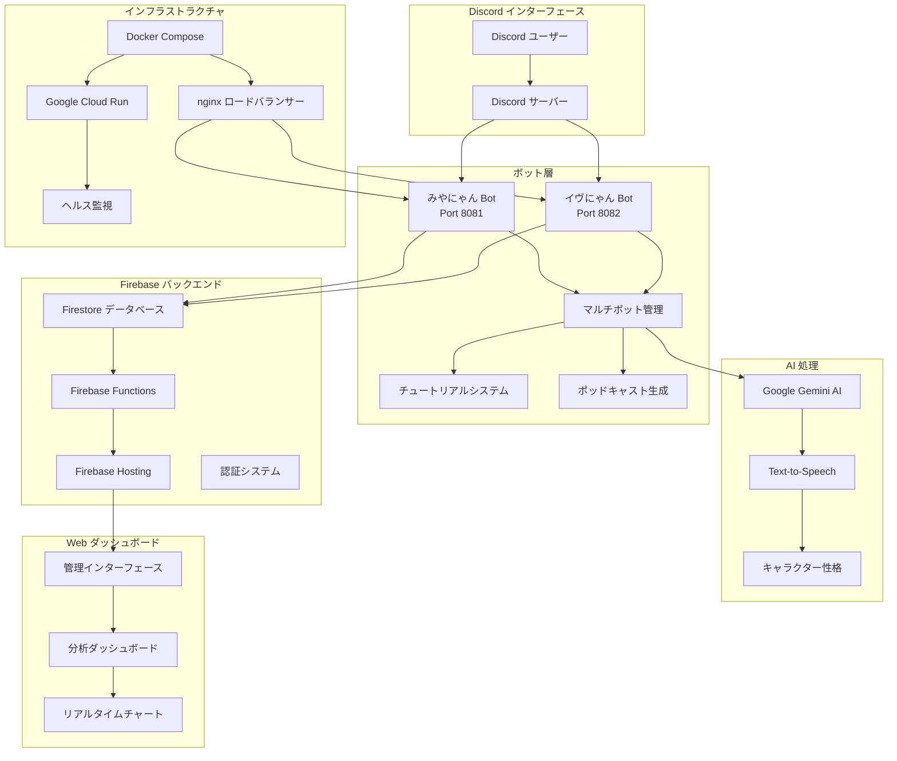
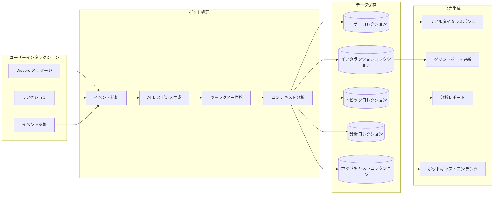
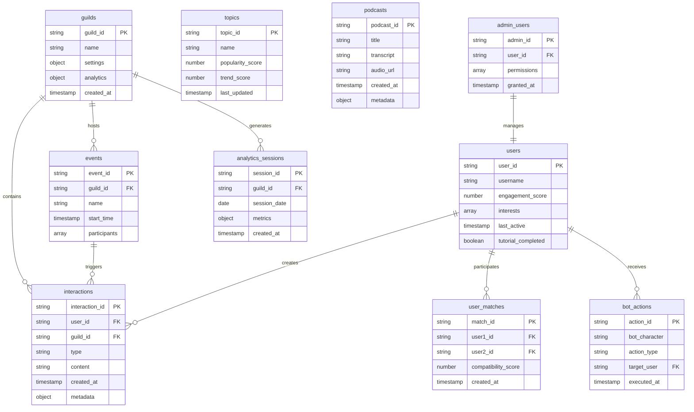
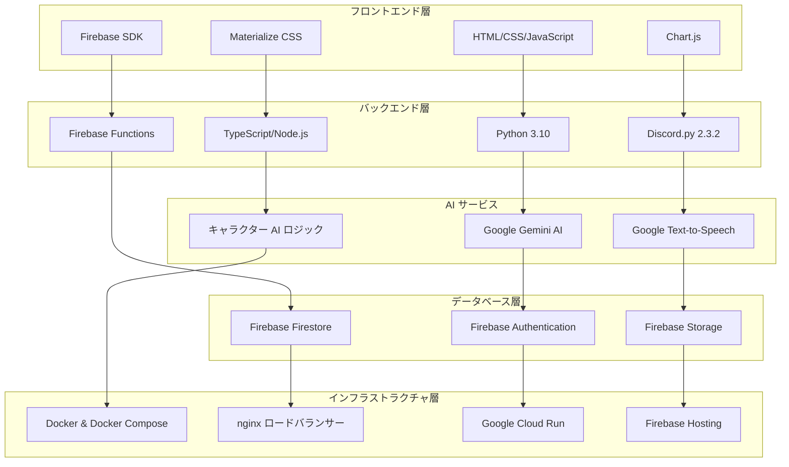
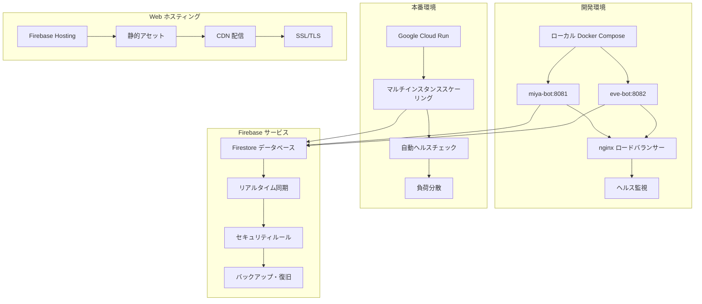
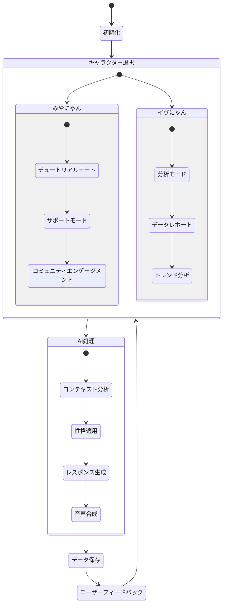
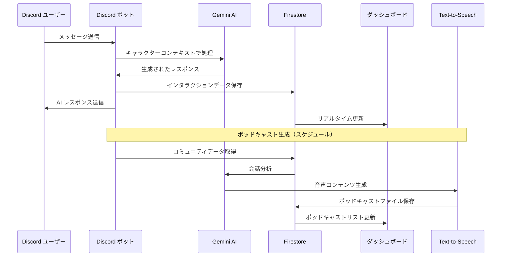

# システム構造図

## 全体アーキテクチャ

```mermaid
graph TB
    subgraph "Discord インターフェース"
        A[Discord ユーザー]
        B[Discord サーバー]
    end
    
    subgraph "ボット層"
        C[みやにゃん Bot<br/>Port 8081]
        D[イヴにゃん Bot<br/>Port 8082]
        E[マルチボット管理]
        F[チュートリアルシステム]
        G[ポッドキャスト生成]
    end
    
    subgraph "AI 処理"
        H[Google Gemini AI]
        I[Text-to-Speech]
        J[キャラクター性格]
    end
    
    subgraph "Firebase バックエンド"
        K[Firestore データベース]
        L[Firebase Functions]
        M[Firebase Hosting]
        N[認証システム]
    end
    
    subgraph "Web ダッシュボード"
        O[管理インターフェース]
        P[分析ダッシュボード]
        Q[リアルタイムチャート]
    end
    
    subgraph "インフラストラクチャ"
        R[Docker Compose]
        S[nginx ロードバランサー]
        T[Google Cloud Run]
        U[ヘルス監視]
    end

    A --> B
    B --> C
    B --> D
    C --> E
    D --> E
    E --> F
    E --> G
    E --> H
    H --> I
    I --> J
    C --> K
    D --> K
    K --> L
    L --> M
    M --> O
    O --> P
    P --> Q
    R --> S
    S --> C
    S --> D
    R --> T
    T --> U
```

## データフロー図

```mermaid
flowchart LR
    subgraph "ユーザーインタラクション"
        A1[Discord メッセージ]
        A2[リアクション]
        A3[イベント参加]
    end
    
    subgraph "ボット処理"
        B1[イベント捕捉]
        B2[AI レスポンス生成]
        B3[キャラクター性格]
        B4[コンテキスト分析]
    end
    
    subgraph "データ保存"
        C1[(ユーザーコレクション)]
        C2[(インタラクションコレクション)]
        C3[(トピックコレクション)]
        C4[(分析コレクション)]
        C5[(ポッドキャストコレクション)]
    end
    
    subgraph "出力生成"
        D1[リアルタイムレスポンス]
        D2[ダッシュボード更新]
        D3[分析レポート]
        D4[ポッドキャストコンテンツ]
    end

    A1 --> B1
    A2 --> B1
    A3 --> B1
    B1 --> B2
    B2 --> B3
    B3 --> B4
    B4 --> C1
    B4 --> C2
    B4 --> C3
    B4 --> C4
    B4 --> C5
    C1 --> D1
    C2 --> D2
    C3 --> D3
    C5 --> D4
```

## データベース構造

```mermaid
erDiagram
    users {
        string user_id PK
        string username
        number engagement_score
        array interests
        timestamp last_active
        boolean tutorial_completed
    }
    
    interactions {
        string interaction_id PK
        string user_id FK
        string guild_id FK
        string type
        string content
        timestamp created_at
        object metadata
    }
    
    guilds {
        string guild_id PK
        string name
        object settings
        object analytics
        timestamp created_at
    }
    
    topics {
        string topic_id PK
        string name
        number popularity_score
        number trend_score
        timestamp last_updated
    }
    
    podcasts {
        string podcast_id PK
        string title
        string transcript
        string audio_url
        timestamp created_at
        object metadata
    }
    
    events {
        string event_id PK
        string guild_id FK
        string name
        timestamp start_time
        array participants
    }
    
    user_matches {
        string match_id PK
        string user1_id FK
        string user2_id FK
        number compatibility_score
        timestamp created_at
    }
    
    analytics_sessions {
        string session_id PK
        string guild_id FK
        date session_date
        object metrics
        timestamp created_at
    }
    
    bot_actions {
        string action_id PK
        string bot_character
        string action_type
        string target_user FK
        timestamp executed_at
    }
    
    admin_users {
        string admin_id PK
        string user_id FK
        array permissions
        timestamp granted_at
    }

    users ||--o{ interactions : creates
    users ||--o{ user_matches : participates
    users ||--o{ bot_actions : receives
    guilds ||--o{ interactions : contains
    guilds ||--o{ events : hosts
    guilds ||--o{ analytics_sessions : generates
    events ||--o{ interactions : triggers
    admin_users ||--|| users : manages
```

## 技術スタック構成

```mermaid
graph TD
    subgraph "フロントエンド層"
        A[HTML/CSS/JavaScript]
        B[Chart.js]
        C[Materialize CSS]
        D[Firebase SDK]
    end
    
    subgraph "バックエンド層"
        E[Python 3.10]
        F[Discord.py 2.3.2]
        G[TypeScript/Node.js]
        H[Firebase Functions]
    end
    
    subgraph "AI サービス"
        I[Google Gemini AI]
        J[Google Text-to-Speech]
        K[キャラクター AI ロジック]
    end
    
    subgraph "データベース層"
        L[Firebase Firestore]
        M[Firebase Authentication]
        N[Firebase Storage]
    end
    
    subgraph "インフラストラクチャ層"
        O[Docker & Docker Compose]
        P[nginx ロードバランサー]
        Q[Google Cloud Run]
        R[Firebase Hosting]
    end

    A --> E
    B --> F
    C --> G
    D --> H
    E --> I
    F --> J
    G --> K
    H --> L
    I --> M
    J --> N
    K --> O
    L --> P
    M --> Q
    N --> R
```

## デプロイメント構成

```mermaid
graph TB
    subgraph "開発環境"
        A[ローカル Docker Compose]
        A1[miya-bot:8081]
        A2[eve-bot:8082]
        A3[nginx ロードバランサー]
        A4[ヘルス監視]
    end
    
    subgraph "本番環境"
        B[Google Cloud Run]
        B1[マルチインスタンススケーリング]
        B2[自動ヘルスチェック]
        B3[負荷分散]
    end
    
    subgraph "Firebase サービス"
        C[Firestore データベース]
        C1[リアルタイム同期]
        C2[セキュリティルール]
        C3[バックアップ・復旧]
    end
    
    subgraph "Web ホスティング"
        D[Firebase Hosting]
        D1[静的アセット]
        D2[CDN 配信]
        D3[SSL/TLS]
    end

    A --> A1
    A --> A2
    A1 --> A3
    A2 --> A3
    A3 --> A4
    
    B --> B1
    B1 --> B2
    B2 --> B3
    
    A1 --> C
    A2 --> C
    B1 --> C
    C --> C1
    C1 --> C2
    C2 --> C3
    
    D --> D1
    D1 --> D2
    D2 --> D3
```

## キャラクター管理システム

```mermaid
stateDiagram-v2
    [*] --> 初期化
    初期化 --> キャラクター選択
    
    state キャラクター選択 {
        [*] --> みやにゃん
        [*] --> イヴにゃん
        
        state みやにゃん {
            [*] --> チュートリアルモード
            チュートリアルモード --> サポートモード
            サポートモード --> コミュニティエンゲージメント
        }
        
        state イヴにゃん {
            [*] --> 分析モード
            分析モード --> データレポート
            データレポート --> トレンド分析
        }
    }
    
    キャラクター選択 --> AI処理
    
    state AI処理 {
        [*] --> コンテキスト分析
        コンテキスト分析 --> 性格適用
        性格適用 --> レスポンス生成
        レスポンス生成 --> 音声合成
    }
    
    AI処理 --> データ保存
    データ保存 --> ユーザーフィードバック
    ユーザーフィードバック --> キャラクター選択
```

## 主要機能フロー

```mermaid
sequenceDiagram
    participant User as Discord ユーザー
    participant Bot as Discord ボット
    participant AI as Gemini AI
    participant DB as Firestore
    participant Web as ダッシュボード
    participant TTS as Text-to-Speech
    
    User->>Bot: メッセージ送信
    Bot->>AI: キャラクターコンテキストで処理
    AI->>Bot: 生成されたレスポンス
    Bot->>DB: インタラクションデータ保存
    Bot->>User: AI レスポンス送信
    DB->>Web: リアルタイム更新
    
    Note over Bot,TTS: ポッドキャスト生成（スケジュール）
    Bot->>DB: コミュニティデータ取得
    DB->>AI: 会話分析
    AI->>TTS: 音声コンテンツ生成
    TTS->>DB: ポッドキャストファイル保存
    DB->>Web: ポッドキャストリスト更新
```