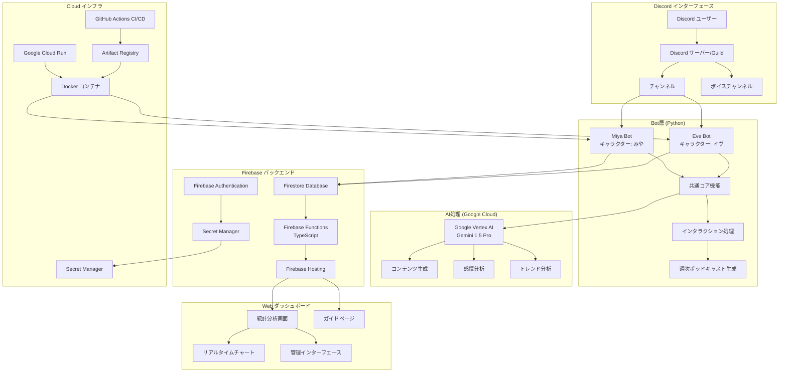
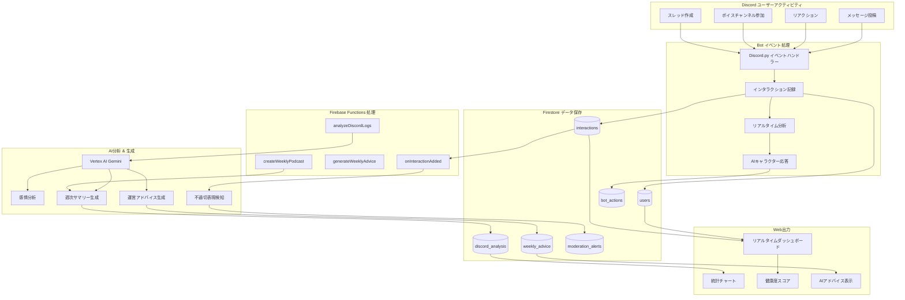
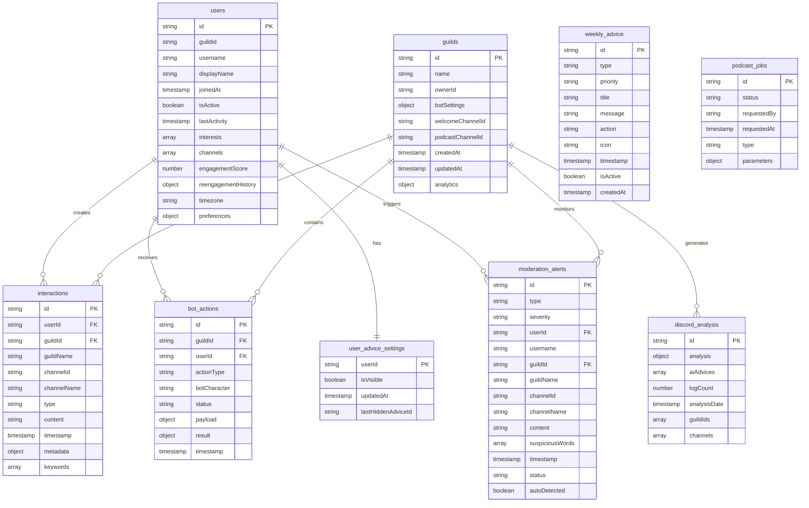
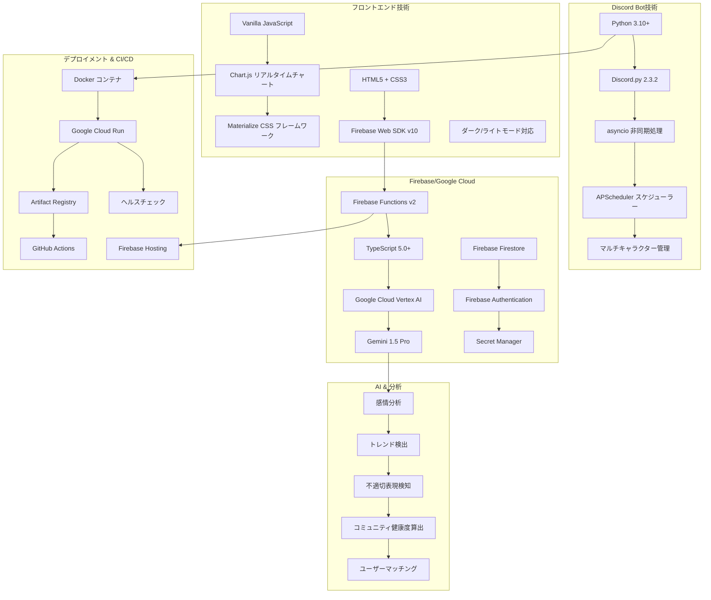
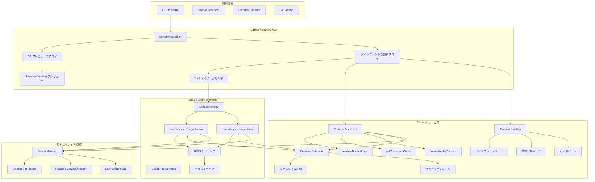
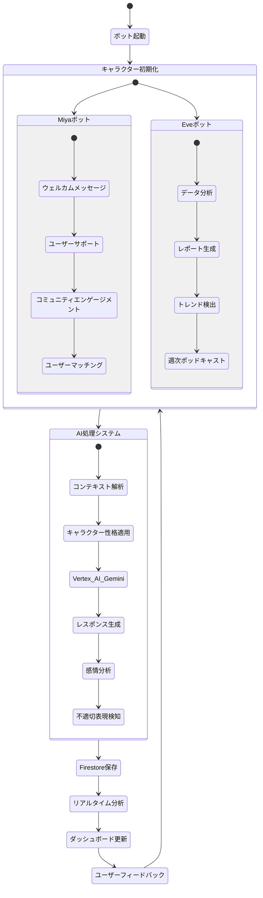
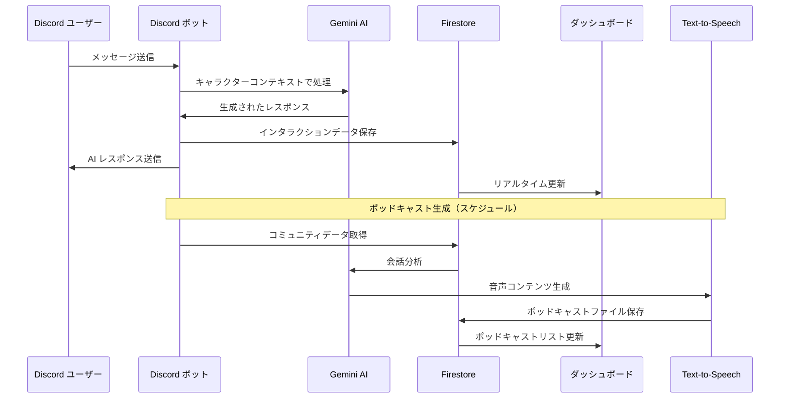

# Discord にゃんこエージェント システム構造図

## 全体アーキテクチャ

```mermaid
graph TB
    subgraph "Discord インターフェース"
        A[Discord ユーザー]
        B[Discord サーバー/Guild]
        B1[チャンネル]
        B2[ボイスチャンネル]
    end
    
    subgraph "Bot層 (Python)"
        C[Miya Bot<br/>キャラクター: みや]
        D[Eve Bot<br/>キャラクター: イヴ]
        E[共通コア機能]
        F[インタラクション処理]
        G[週次ポッドキャスト生成]
    end
    
    subgraph "AI処理 (Google Cloud)"
        H[Google Vertex AI<br/>Gemini 1.5 Pro]
        I[コンテンツ生成]
        J[感情分析]
        K[トレンド分析]
    end
    
    subgraph "Firebase バックエンド"
        L[Firestore Database]
        M[Firebase Functions<br/>TypeScript]
        N[Firebase Hosting]
        O[Firebase Authentication]
        P[Secret Manager]
    end
    
    subgraph "Web ダッシュボード"
        Q[統計分析画面]
        R[リアルタイムチャート]
        S[管理インターフェース]
        T[ガイドページ]
    end
    
    subgraph "Cloud インフラ"
        U[Google Cloud Run]
        V[Docker コンテナ]
        W[Artifact Registry]
        X[GitHub Actions CI/CD]
        Y[Secret Manager]
    end

    A --> B
    B --> B1
    B --> B2
    B1 --> C
    B1 --> D
    C --> E
    D --> E
    E --> F
    F --> G
    E --> H
    H --> I
    H --> J
    H --> K
    C --> L
    D --> L
    L --> M
    M --> N
    N --> Q
    Q --> R
    Q --> S
    N --> T
    U --> V
    V --> C
    V --> D
    W --> V
    X --> W
    P --> Y
    O --> P
```

## データフロー図

```mermaid
flowchart TD
    subgraph "Discord ユーザーアクティビティ"
        A1[メッセージ投稿]
        A2[リアクション]
        A3[ボイスチャンネル参加]
        A4[スレッド作成]
    end
    
    subgraph "Bot イベント処理"
        B1[Discord.py イベントハンドラー]
        B2[インタラクション記録]
        B3[リアルタイム分析]
        B4[AIキャラクター応答]
    end
    
    subgraph "Firestore データ保存"
        C1[(users)]
        C2[(interactions)]
        C3[(discord_analysis)]
        C4[(weekly_advice)]
        C5[(bot_actions)]
        C6[(moderation_alerts)]
    end
    
    subgraph "Firebase Functions 処理"
        D1[analyzeDiscordLogs]
        D2[onInteractionAdded]
        D3[generateWeeklyAdvice]
        D4[createWeeklyPodcast]
    end
    
    subgraph "AI分析 & 生成"
        E1[Vertex AI Gemini]
        E2[感情分析]
        E3[不適切表現検知]
        E4[週次サマリー生成]
        E5[運営アドバイス生成]
    end
    
    subgraph "Web出力"
        F1[リアルタイムダッシュボード]
        F2[統計チャート]
        F3[健康度スコア]
        F4[AIアドバイス表示]
    end

    A1 --> B1
    A2 --> B1
    A3 --> B1
    A4 --> B1
    
    B1 --> B2
    B2 --> B3
    B3 --> B4
    
    B2 --> C1
    B2 --> C2
    B4 --> C5
    
    C2 --> D2
    D2 --> E3
    E3 --> C6
    
    D1 --> E1
    E1 --> E2
    E1 --> E4
    E1 --> E5
    
    E4 --> C3
    E5 --> C4
    
    D4 --> E4
    
    C1 --> F1
    C2 --> F1
    C3 --> F2
    C4 --> F4
    F1 --> F3
```

## Firestore データベース構造

```mermaid
erDiagram
    users {
        string id PK
        string guildId
        string username
        string displayName
        timestamp joinedAt
        boolean isActive
        timestamp lastActivity
        array interests
        array channels
        number engagementScore
        object reengagementHistory
        string timezone
        object preferences
    }
    
    interactions {
        string id PK
        string userId FK
        string guildId FK
        string guildName
        string channelId
        string channelName
        string type
        string content
        timestamp timestamp
        object metadata
        array keywords
    }
    
    guilds {
        string id PK
        string name
        string ownerId
        object botSettings
        string welcomeChannelId
        string podcastChannelId
        timestamp createdAt
        timestamp updatedAt
        object analytics
    }
    
    discord_analysis {
        string id PK
        object analysis
        array aiAdvices
        number logCount
        timestamp analysisDate
        array guildIds
        array channels
    }
    
    weekly_advice {
        string id PK
        string type
        string priority
        string title
        string message
        string action
        string icon
        timestamp timestamp
        boolean isActive
        timestamp createdAt
    }
    
    bot_actions {
        string id PK
        string guildId FK
        string userId FK
        string actionType
        string botCharacter
        string status
        object payload
        object result
        timestamp timestamp
    }
    
    moderation_alerts {
        string id PK
        string type
        string severity
        string userId FK
        string username
        string guildId FK
        string guildName
        string channelId
        string channelName
        string content
        array suspiciousWords
        timestamp timestamp
        string status
        boolean autoDetected
    }
    
    podcast_jobs {
        string id PK
        string status
        string requestedBy
        timestamp requestedAt
        string type
        object parameters
    }
    
    user_advice_settings {
        string userId PK
        boolean isVisible
        timestamp updatedAt
        string lastHiddenAdviceId
    }

    users ||--o{ interactions : creates
    users ||--o{ bot_actions : receives
    users ||--|| user_advice_settings : has
    guilds ||--o{ interactions : contains
    guilds ||--o{ discord_analysis : generates
    guilds ||--o{ bot_actions : contains
    users ||--o{ moderation_alerts : triggers
    guilds ||--o{ moderation_alerts : monitors
```

## 技術スタック構成

```mermaid
graph TD
    subgraph "フロントエンド技術"
        A[HTML5 + CSS3]
        B[Vanilla JavaScript]
        C[Chart.js リアルタイムチャート]
        D[Materialize CSS フレームワーク]
        E[Firebase Web SDK v10]
        F[ダーク/ライトモード対応]
    end
    
    subgraph "Discord Bot技術"
        G[Python 3.10+]
        H[Discord.py 2.3.2]
        I[asyncio 非同期処理]
        J[APScheduler スケジューラー]
        K[マルチキャラクター管理]
    end
    
    subgraph "Firebase/Google Cloud"
        L[Firebase Functions v2]
        M[TypeScript 5.0+]
        N[Google Cloud Vertex AI]
        O[Gemini 1.5 Pro]
        P[Firebase Firestore]
        Q[Firebase Authentication]
        R[Secret Manager]
    end
    
    subgraph "AI & 分析"
        S[感情分析]
        T[トレンド検出]
        U[不適切表現検知]
        V[コミュニティ健康度算出]
        W[ユーザーマッチング]
    end
    
    subgraph "デプロイメント & CI/CD"
        X[Docker コンテナ]
        Y[Google Cloud Run]
        Z[Artifact Registry]
        AA[GitHub Actions]
        BB[Firebase Hosting]
        CC[ヘルスチェック]
    end

    A --> E
    B --> C
    C --> D
    E --> L
    
    G --> H
    H --> I
    I --> J
    J --> K
    
    L --> M
    M --> N
    N --> O
    O --> S
    
    P --> Q
    Q --> R
    
    S --> T
    T --> U
    U --> V
    V --> W
    
    G --> X
    X --> Y
    Y --> Z
    Z --> AA
    L --> BB
    Y --> CC
```

## デプロイメント構成 & CI/CD

```mermaid
graph TB
    subgraph "開発環境"
        A[ローカル開発]
        A1[Discord Bot Local]
        A2[Firebase Emulator]
        A3[Hot Reload]
    end
    
    subgraph "GitHub Actions CI/CD"
        B[GitHub Repository]
        B1[PR プレビューデプロイ]
        B2[Firebase Hosting プレビュー]
        B3[メインブランチ自動デプロイ]
        B4[Docker イメージビルド]
    end
    
    subgraph "Google Cloud 本番環境"
        C[Cloud Run Services]
        C1[discord-nyanco-agent-miya]
        C2[discord-nyanco-agent-eve]
        C3[Artifact Registry]
        C4[自動スケーリング]
        C5[ヘルスチェック]
    end
    
    subgraph "Firebase サービス"
        D[Firebase Functions]
        D1[analyzeDiscordLogs]
        D2[getConnectedGuilds]
        D3[createWeeklyPodcast]
        E[Firebase Hosting]
        E1[メインダッシュボード]
        E2[統計分析ページ]
        E3[ガイドページ]
        F[Firestore Database]
        F1[リアルタイム同期]
        F2[セキュリティルール]
    end
    
    subgraph "セキュリティ & 設定"
        G[Secret Manager]
        G1[Discord Bot Tokens]
        G2[Firebase Service Account]
        G3[GCP Credentials]
    end

    A --> B
    B --> B1
    B1 --> B2
    B --> B3
    B3 --> B4
    
    B4 --> C3
    C3 --> C1
    C3 --> C2
    C1 --> C4
    C2 --> C4
    C4 --> C5
    
    B3 --> D
    D --> D1
    D --> D2
    D --> D3
    
    B3 --> E
    E --> E1
    E --> E2
    E --> E3
    
    C1 --> F
    C2 --> F
    D --> F
    F --> F1
    F --> F2
    
    C1 --> G
    C2 --> G
    D --> G
    G --> G1
    G --> G2
    G --> G3
```

## キャラクター管理システム

```mermaid
stateDiagram-v2
    [*] --> ボット起動
    ボット起動 --> キャラクター初期化
    
    state キャラクター初期化 {
        [*] --> Miyaボット
        [*] --> Eveボット
        
        state Miyaボット {
            [*] --> ウェルカムメッセージ
            ウェルカムメッセージ --> ユーザーサポート
            ユーザーサポート --> コミュニティエンゲージメント
            コミュニティエンゲージメント --> ユーザーマッチング
        }
        
        state Eveボット {
            [*] --> データ分析
            データ分析 --> レポート生成
            レポート生成 --> トレンド検出
            トレンド検出 --> 週次ポッドキャスト
        }
    }
    
    キャラクター初期化 --> AI処理システム
    
    state AI処理システム {
        [*] --> コンテキスト解析
        コンテキスト解析 --> キャラクター性格適用
        キャラクター性格適用 --> Vertex_AI_Gemini
        Vertex_AI_Gemini --> レスポンス生成
        レスポンス生成 --> 感情分析
        感情分析 --> 不適切表現検知
    }
    
    AI処理システム --> Firestore保存
    Firestore保存 --> リアルタイム分析
    リアルタイム分析 --> ダッシュボード更新
    ダッシュボード更新 --> ユーザーフィードバック
    ユーザーフィードバック --> キャラクター初期化
```

## 主要機能フロー

```mermaid
sequenceDiagram
    participant User as Discord ユーザー
    participant Bot as Discord ボット
    participant AI as Gemini AI
    participant DB as Firestore
    participant Web as ダッシュボード
    participant TTS as Text-to-Speech
    
    User->>Bot: メッセージ送信
    Bot->>AI: キャラクターコンテキストで処理
    AI->>Bot: 生成されたレスポンス
    Bot->>DB: インタラクションデータ保存
    Bot->>User: AI レスポンス送信
    DB->>Web: リアルタイム更新
    
    Note over Bot,TTS: ポッドキャスト生成（スケジュール）
    Bot->>DB: コミュニティデータ取得
    DB->>AI: 会話分析
    AI->>TTS: 音声コンテンツ生成
    TTS->>DB: ポッドキャストファイル保存
    DB->>Web: ポッドキャストリスト更新
```